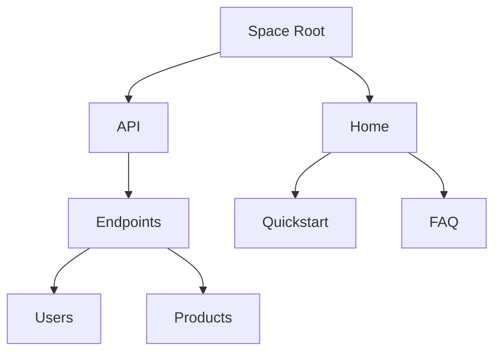

## Overview

EasyShoppingClub organizes your documentation into intuitive structures. You manage content through spaces, build pages with hierarchies, and control access via permissions. These core concepts help you create scalable, collaborative docs.

<Columns cols={3}>
  <Card title="Spaces" icon="layout" href="#documentation-spaces">
    Containerize your projects into isolated documentation areas.
  </Card>
  <Card title="Pages" icon="file-text" href="#page-structures">
    Structure content with nested hierarchies and MDX components.
  </Card>
  <Card title="Permissions" icon="shield" href="#collaboration">
    Define roles to enable secure team collaboration.
  </Card>
</Columns>

## Documentation Spaces

Spaces group related documentation. Create a space for each project, like "EasyShoppingClub API" or "User Guides". Each space holds pages, settings, and members.

<Steps>
  <Step title="Create a Space" icon="plus">
    Navigate to the Spaces dashboard. Click **New Space**, enter a name like `API Docs`, and select a description.
  </Step>
  <Step title="Configure Settings" icon="settings">
    Set visibility to public or private. Add custom domains if needed.
  </Step>
  <Step title="Add Pages" icon="file-plus">
    Start with a homepage. Spaces auto-generate navigation.
  </Step>
</Steps>

<Callout kind="tip">
  Use one space per audience: internal for teams, public for users.
</Callout>

## Page Structures and Hierarchies

Pages form a tree-like hierarchy within spaces. Nest subpages for logical navigation, like `/api/endpoints/users` under `/api`.



Use frontmatter in MDX files for metadata:

<CodeGroup tabs="YAML Frontmatter">
  ```yaml
  ---
  title: Users Endpoint
  description: Manage user accounts via REST API.
  ---
  ```
</CodeGroup>

## Collaboration and Permissions

Control who edits, views, or admins your docs. Assign roles at space or page level.

<Tabs>
  <Tab title="Admin" icon="shield-check">
    Full access: edit pages, manage members, configure spaces.
  </Tab>
  <Tab title="Editor" icon="edit-3">
    Create and update pages, but cannot delete spaces.
  </Tab>
  <Tab title="Viewer" icon="eye">
    Read-only access to published content.
  </Tab>
</Tabs>

<Expandable title="Advanced Permissions" default-open="false">

Set granular permissions via YAML config:

````yaml
permissions:
  roles:
    - name: editor
      can_edit: true
      can_publish: true
    - name: viewer
      can_read: true
````

</Expandable>

<Callout kind="info">
  Review permissions weekly to maintain security as teams grow.
</Callout>

These concepts scale with your needs. Start small, then expand hierarchies and roles.